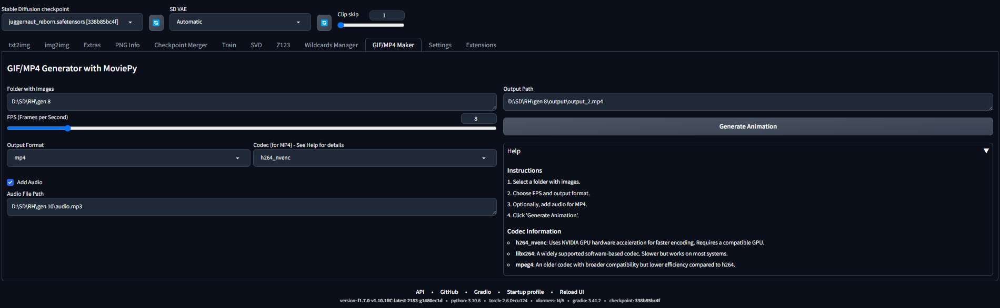

# SD WebUI GIF Movie Maker

A custom extension for [AUTOMATIC1111/stable-diffusion-webui](https://github.com/AUTOMATIC1111/stable-diffusion-webui) that allows users to create GIFs and movies directly from the WebUI.




## Table of Contents

   * [Basic Usage](#basic-usage)
   * [Installation](#installation)
   * [Configuration](#configuration)
   * [Troubleshooting](#troubleshooting)
   * [Features](#features)
   * [Future Plans](#future-plans)
   * [Why This Extension Exists](#why-this-extension-exists)

## Example GIFs


## Basic Usage
This extension enables users to create animated GIFs or MP4 files from generated images. Simply provide the path to the folder containing the images (ensuring they are ordered as desired), configure the animation settings, and export your creation.

## Installation
The extension can be installed directly from within the **Extensions** tab in the WebUI.

Alternatively, you can install it manually by running the following command from within the extensions WebUI directory:

```shell
git clone https://github.com/AUTOMATIC1111/sd-webui-gifmoviemaker extensions/sd-webui-gifmoviemaker
```

## Configuration
You can configure animation settings such as frame rate and output format in the extension's settings tab. Note that resolution adjustments are not yet supported. Additionally, when exporting videos, you can choose between three different codecs for video generation.

## Troubleshooting
If you encounter any issues, ensure you have the latest version of the extension. Check the logs for error messages and consult the [issues section](https://github.com/your-repo/sd-webui-gifmoviemaker/issues) on GitHub for solutions.

## Features
- Create GIFs and movies from any images, as long as all images have the same resolution.
- Customize frame rate.
- Export in multiple formats (GIF, MP4, etc.).
- Easy-to-use interface integrated into the WebUI.
- Add audio to the final video during export.

## Future Plans

- Add a control to define the resolution of the final export.
- Improve the interface with buttons to access the output location.
- Add drag-and-drop or file selection controls for images/audio inputs.
- Long-term: Integrate a custom control system to allow users to fine-tune frame interpolation settings, enabling smoother and more personalized video outputs. (Probably using RIFE by hzwer)

## Why This Extension Exists

Honestly, this extension was born out of pure laziness. I got tired of spending too much time manually stitching images together into a single video. It felt like such a hassle! So, I decided to create this extension for myself to make the process quick and painless. Now, I can turn my images into GIFs or videos in just a few clicks—and hopefully, it makes your life easier too!